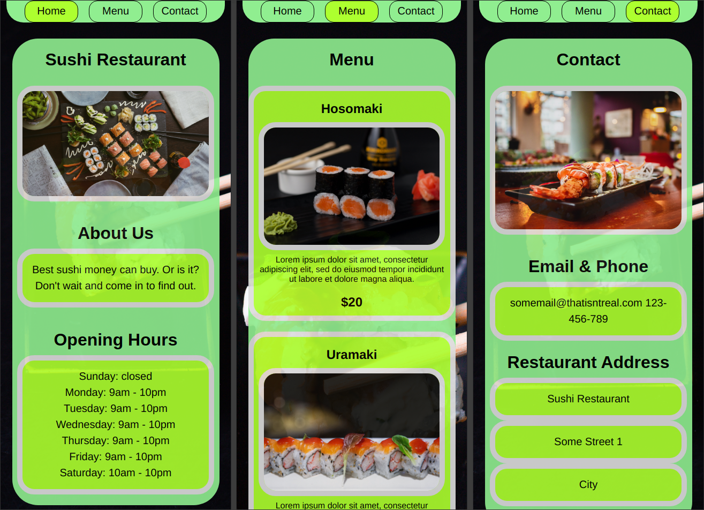

# Odin Project #10: Restaurant Page

The goal of this project was to create a restaurant page using JavaScript and ES6 Modules to dynamically generate the contents of the site.

I started and finished this project in September 2022.

## Assignment

[The Odin Project - JavaScript - #10 Restaurant Page](https://www.theodinproject.com/lessons/node-path-javascript-restaurant-page)

## Technology

- Vanilla JavaScript
- Webpack
- CSS

## Key Concepts

- ES6 Modules
- Creating & appending html elements
- Event listeners
- Webpack configuration & dev server

## Features

- Clicking each tab causes the current content to be removed and the new content to be rendered.

## Links

[Live Demo](https://brightneon7631.github.io/odin-restaurant-page/)

[My Other Projects](https://brightneon7631.github.io/odin-scrimba-projects/)

## Screenshots

### Desktop


### Mobile



## Sources

- https://unsplash.com/photos/4ykELaXgeOM by Luc Bercoth
- https://unsplash.com/photos/iOHJKJqO6E0 by Jakub Dziubak
- https://unsplash.com/photos/wXkGvQJWI-Y by Louis Hansel
- https://unsplash.com/photos/FBezBX26dyY by Mahmoud Fawzy
- https://unsplash.com/photos/9sFos3nkhaE by Ahtziri Lagarde
- https://unsplash.com/photos/EUf-J5PDIcI by Felippe Lopes

## Deployment

```bash
# clone repo
git clone

# install project dependencies
npm install

# run webpack dev server
npm start

# create a production build
npm run build

```
